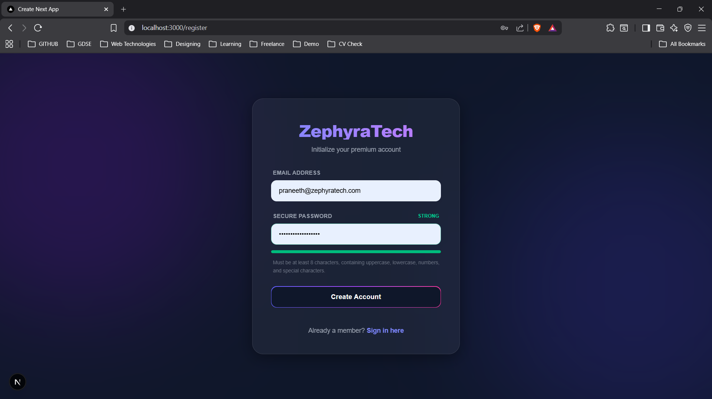
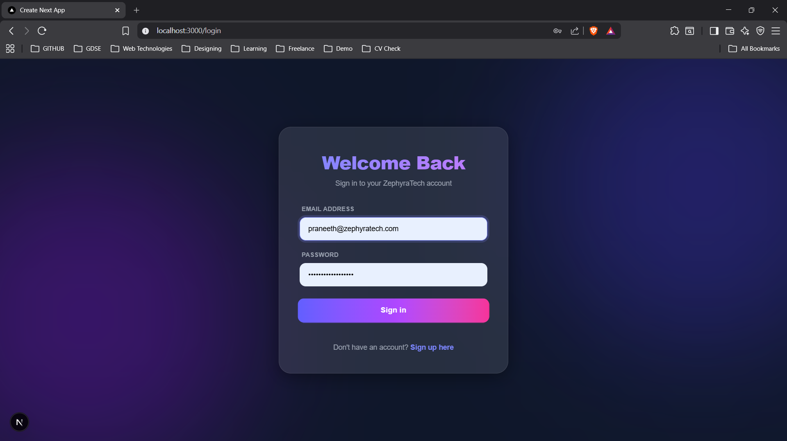
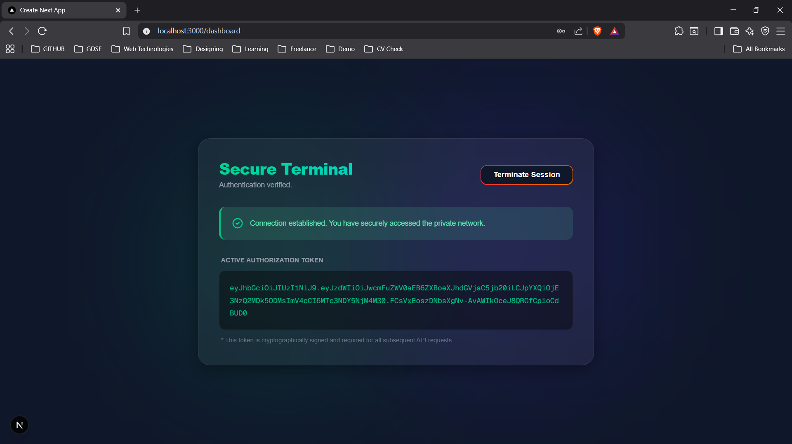

# ZephyraTech — Full-Stack Authentication System

A complete, secure, and visually stunning Login & Registration system built for the ZephyraTech technical assessment. This monorepo contains a robust Spring Boot 4.0 REST API and a premium Next.js 16 Glassmorphism frontend.

---

## Project Overview

This project was engineered with a strict focus on enterprise-grade security, clean MVC architecture, and exceptional User Experience (UX).

**The Backend (`/backend`)** handles stateless JWT authentication, password hashing, automated database generation, and structured global exception handling.

**The Frontend (`/frontend`)** features a custom "Glassmorphism" dark-mode UI, real-time visual password strength validation, and protected client-side routing.

---

> **Note on Security Architecture**
>
> For the scope of this assessment, the JWT is stored in `localStorage` for rapid prototyping. In a true production enterprise environment, I would configure the Spring Boot backend to issue the JWT securely inside an `httpOnly`, `Secure`, `SameSite=Strict` cookie to mitigate Cross-Site Scripting (XSS) vulnerabilities.

---

## Application Previews

**1. Real-Time Registration & Password Strength**  
*Provides instant UX feedback before network submission.*



**2. Secure Login Interface**  
*Clean, responsive, and handles structured API errors beautifully.*



**3. Protected Dashboard**  
*A hard-gated route that requires a valid JWT for access.*



---

## Technologies & Architecture

### Backend Stack

| Layer | Technology |
|---|---|
| Framework | Spring Boot 4.0.5 (Java 21) |
| Security | Spring Security 7, JSON Web Tokens (JWT), BCrypt |
| Database | MySQL 8.0, Spring Data JPA (Hibernate) |
| Validation | Jakarta Validation (`@Pattern`, `@Email`) |

### Frontend Stack

| Layer | Technology |
|---|---|
| Framework | Next.js 16 (App Router), React 19 |
| Language | TypeScript |
| Styling | Tailwind CSS — Custom Glassmorphism & Aurora Orbs |
| API Client | Axios — Centralized instance |

---

## Quick Start Guide

### 1. Database Configuration

Ensure you have a local instance of MySQL running on port `3306`. The application uses the `createDatabaseIfNotExist=true` flag, so it will automatically generate the `zephyratech_auth` schema and tables on startup.

### 2. Start the API — Backend

Open a terminal and run the Spring Boot application using the Maven Wrapper:
```bash
  cd backend
  ./mvnw spring-boot:run
```

> **Windows users:** Use `mvnw.cmd spring-boot:run`

The API will start on `http://localhost:8080`.

### 3. Start the Client — Frontend

Open a new terminal window, install the dependencies, and start Next.js:
```bash
  cd frontend
  npm install
  npm run dev
```

The application UI will be available at `http://localhost:3000`.

---

## API Documentation & Testing

To facilitate easy evaluation, a fully configured Postman Collection has been included in the repository.

| | |
|---|---|
| **Location** | `backend/docs/ZephyraTech_Auth_API.postman_collection.json` |
| **Usage** | Import this file directly into Postman. It includes pre-configured variables and request bodies for the `/register` and `/login` endpoints. |

---

*Developed by **Vinod Niloshana** for the ZephyraTech Solutions (Pvt) Ltd Internship Assessment.*